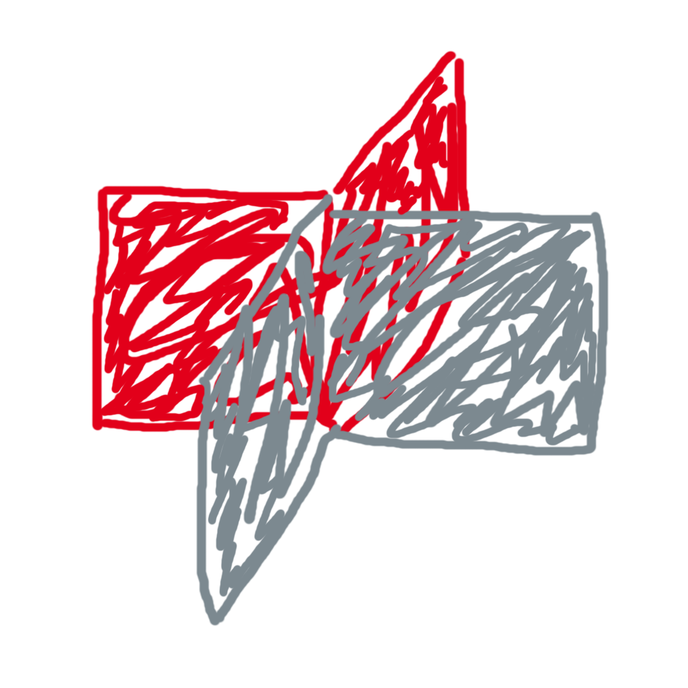

<p align="center">
  
</p>

# DHBW App Wrapper

**Unofficial wrapper application for [dhbw.app](https://dhbw.app)**

> ⚠️ **Disclaimer**: This is an unofficial, community-maintained application and is not affiliated with, endorsed by, or officially connected to DHBW or dhbw.app in any way.

## About

This is a simple React Native wrapper application that embeds the [dhbw.app](https://dhbw.app) website in a WebView. It provides a native mobile app experience for iOS and Android platforms.

## Local Development

### Prerequisites

- [Bun](https://bun.sh/) - Fast JavaScript runtime and package manager
- [Expo CLI](https://docs.expo.dev/get-started/installation/)
- For iOS development: macOS with Xcode
- For Android development: Android Studio with Android SDK

### Getting Started

1. **Install dependencies**

   ```bash
   bun install
   ```

2. **Start the development server**

   ```bash
   bun start
   ```

3. **Run on a device**

   - Scan the QR code with the Expo Go app (iOS/Android)
   - Or press `a` for Android emulator
   - Or press `i` for iOS simulator

### Additional Commands

```bash
bun run android  # Start Android emulator
bun run ios      # Start iOS simulator
bun run lint     # Run ESLint
```

## Links

- [dhbw.app](https://dhbw.app) - The official website
- [Report Issues](https://github.com/Crafter-Y/dhbw-app-wrapper/issues)

## License

CC BY 4.0

dhbw-app-wrapper (c) by Crafter-Y

dhbw-app-wrapper is licensed under a
Creative Commons Attribution 4.0 International License.

You should have received a copy of the license along with this
work. If not, see <https://creativecommons.org/licenses/by/4.0/>.